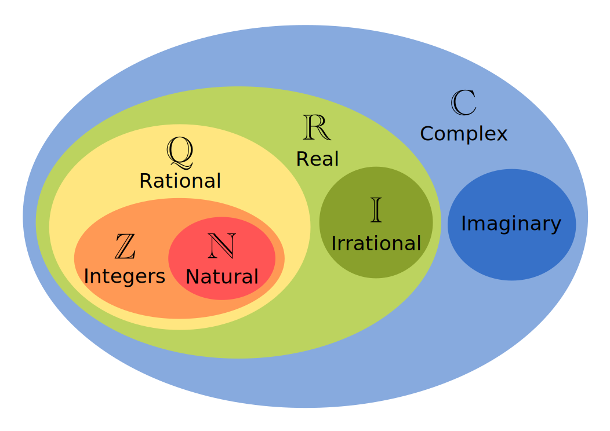
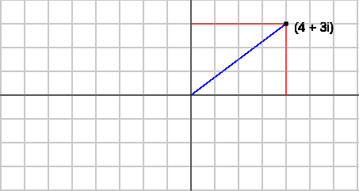

# Conjunto de Mandelbrot

Pode ser que você já tenha ouvido falar do conjunto de Mandelbrot (Mandelbrot set), de fato ele é bem famoso e utilizado por jovens usuários de psicoativos devido a sua beleza e diferentes padrões que surgem ao darmos "zoom" nesse conjunto. Mas matemáticamente, como podemos definir o conjunto de Mandelbrot?

## Números complexos na verdade são bem simples

Antes de tudo, vamos lembrar o que são números complexos. Um número complexo (péssimo nome pra se dar a um conjunto) é qualquer número que possa ser escrito na forma `a + bi` ou `(a, bi)`, onde `a` e `b` são números reais e `i` é um número tal que `i² = -1`, ou seja, temos que o único valor possível para `i` é `√-1`.

Se você nunca estudou números complexos pode estar confuso com `√-1`, muitos professores de ensino fundamental e médio costumam falar que não existem raízes quadradas de números negativos, entretanto uma correção a essa sentença seria de que não existem raízes quadradas _reais_ para números negativos. O conjunto dos números complexos são um superconjunto dos números reais, isso significa que TODOS os números reais são números complexos, porém nem todos os números complexos são reais, quer que eu te prove?

Vamos primeiro provar que todos os números reais são complexos, como eu disse antes, números complexos são números que podem ser escritos na forma `a + bi` ou `(a, bi)`, para escrever qualquer número real como um complexo, simplesmente adotamos para `b` o valor 0, dessa forma temos que o conjunto dos números reais puros é descrito como `{(a, 0i) | a ∈ R}`.

Com o mesmo pensamento porém indo na outra direção, podemos encontrar números dentro do conjunto dos complexos que não são reais, basta assumirmos para `a` o valor 0 e para `b` o valor de todos os reais, assim temos que o conjunto dos números imaginários puros é descrito como `{(0, bi) | b ∈ R}`.

    

Assim como costumamos representar pontos em um plano cartesiano, podemos também representar os números complexos no chamado plano de Argand-Gauss, que possui o eixo `X` como eixo real e o `Y` como eixo imaginário, formando as duas componentes necessárias para representarmos um número complexo `z` da forma `(a, bi)`. No gráfico abaixo está representado o número (4, 3i), descomposto em cada eixo pelas retas vermelhas e uma outra reta azul, representando a magnitude de um número complexo.

    

Geométricamente a magnitude de um número complexo é dada pela distância do número em relação a origem do sistema, com a notação de `|a + bi|` sendo usada para denotar a magnitude no número `a + bi`. Você pode encontrar a magnitude tanto usando a fórmula de distância entre dois pontos quanto pelo teorema de Pitágoras. Como eu não sou bobo escolhi um número que forma o triângulo mais clássico possível, e temos que o valor da hipotenusa (que também é o valor da magnitude desse complexo) é 5.