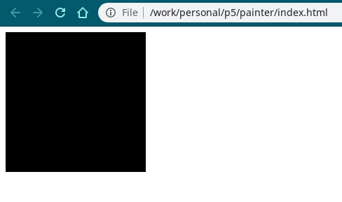
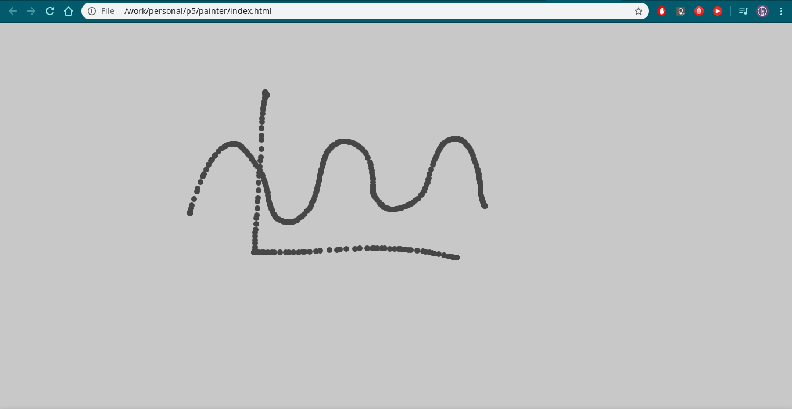

# p5.js - Deixando a web mais bonita

Um pouco de contexto, o movimento iniciado pelo pessoal do Processing em 2001 tem a intenção de disseminar o que eles chamam de "creative coding", se expressar por meio de programação e principalmente distribuir suas criações com facilidade. E por isso a linguagem escolhida no início do desenvolvimento foi Java, afinal, os __applets__ são até hoje uma tecnologia incrível para se construir coisas para web, certo? Ah não? O que o pessoal ta usando hoje em dia? Ok, faremos em Javascript então.

E assim, depois de muito ```system.out.println``` nasceu o p5.js, reaproveitando muito a API do Processing mas usando a "linguagem do momento" e tenho que dizer que é realmente muito mais fácil compartilhar qualquer que seja o que você quiser criar.

Eu realmente prefiro mostrar coisas a explicar elas, então que tal criarmos algo? Eu vou revisitar um dos exemplos mais clássicos do Processing, adicionando algumas coisas extras que eu quero mostrar. Eu vou presumir que você sabe um pouquinho de Javascript ou que pelo menos tenha noções de programação no geral e saiba algumas coisinhas de Linux.

## Hands on

Primeiro vou criar uma base pra esse projetinho em específico (acho que ainda não falei pra vocês mas vamos construir uma cópia super simplificada do Paint), precisamos de um arquivo HTML para ser aberto pelo browser e um arquivo Javascript para ser executado. Só por questões de organização, vou criar uma pasta com isso organizado da seguinte maneira.

```
painter
├── index.html
└── src
    └── sketch.js
```

Você realmente não precisa saber quase nada sobre HTML pra aprender p5.js então vamos pular isso, tudo que você precisa fazer é criar uma página HTML vazia com um link para a versão mais recente do p5 e para o nosso script próprio, pode usar o modelo abaixo:

```html
<html>
    <head>
        <meta charset="UTF-8">
        <title>Painter</title>
        <script src="https://cdn.jsdelivr.net/npm/p5"></script>
        <script src="src/sketch.js"></script>
    </head>
    <body style="margin: 0"></body>
</html>
```

Depois que tiver isso pronto, agora é hora de aprender qual a estrutura básica de um sketch (termo que vou usar pra me referir ao nosso projeto a partir de agora). O p5 reserva alguns nomes de funções que serão interpretadas pela biblioteca pra executar seu código, as duas principais e primeiras que veremos são `draw()` e `setup()`. 

A função `setup` é invocada uma vez no início da execução do script e depois nunca mais é usada, usamos ela pra rodar coisas que devem ser acionadas apenas uma vez, como definições de constantes e criação de elementos fixos.

A função `draw` roda em loop, aproximadamente 30 vezes por segundo e serve para atualizarmos nosso sketch, ou seja, é nela que vamos criar qualquer tipo de animação, interações com usuários e mudanças no sketch que dependem de tempo ou modificação de variáveis.

Um sketch base se parece com algo assim:

```javascript
function setup() {
    // Cria um canvas com as proporções (largura, altura)
    createCanvas(200, 200)
    // Adiciona uma cor de fundo ao canvas, nesse caso em RGB(0,0,0), preto.
    background(0, 0, 0)    
}

function draw(){}
```

Se você abrir o arquivo HTML que criamos anteriormente com esse script linkado em um navegador, vai ver que criou o sketch mais chato e entediante possível, um quadro preto em um fundo branco. Mais especificamente um quadro de 200 pixels de largura e altura.



Que tal deixarmos isso gradativamente mais interessante? Vou começar expandindo nosso quadro para cobrir toda a tela do navegador e colocando uma cor um pouco mais amigável.


```javascript
function setup() {
    // Podemos usar o objeto window para conseguirmos as dimensões da tela
    createCanvas(window.innerWidth, window.innerWidth)
    // Se omitirmos os outros parâmetros, o p5 trata como RGB(a,a,a)
    background(200)    
}

function draw(){}
```

Mas ainda não usamos a função `draw`, todo nosso código até agora é estático e não tem nenhuma interação com o usuário, que tal pintarmos uma ellipse na posição do mouse a cada frame?

> Um frame é uma unidade de atualização, ou seja, se a cada 1 segundo temos 30 atualizações, temos 30 frames por segundo (FPS)

```javascript
function setup() {
    createCanvas(window.innerWidth, window.innerWidth)
    background(200)    
}

function draw(){
    noStroke()
    // Vamos usar fill(x) pra modificar o preenchimento das formas que estamos desenhando
    fill(70)
    // Temos as constantes mouseX e mouseY que recebem a posição do mouse em (x,y) a cada frame
    // ellipse(x, y, width, height)
    ellipse(mouseX, mouseY, 10, 10)
}
```

Apesar de mais interativo, fica meio ruim de desenhar qualquer coisa quando não temos o controle sobre quando o traço é feito, seria legal se a ellipse só fosse desenhada quando clicamos no mouse. Pra isso podemos usar a constante `mouseIsPressed`.

```javascript
function setup() {
    createCanvas(window.innerWidth, window.innerWidth)
    background(200)    
}

function draw(){
    if (mouseIsPressed) {
        noStroke()
        fill(70)
        ellipse(mouseX, mouseY, 10, 10)
    }
}
```

Se tudo deu super certo e o Javascript não ficou irritado com você, no momento temos um sketch simples onde podemos desenhar com linhas cinzas, já é algo que da pra se divertir um pouco, mas ainda muito faltam coisas pra adicionarmos.

